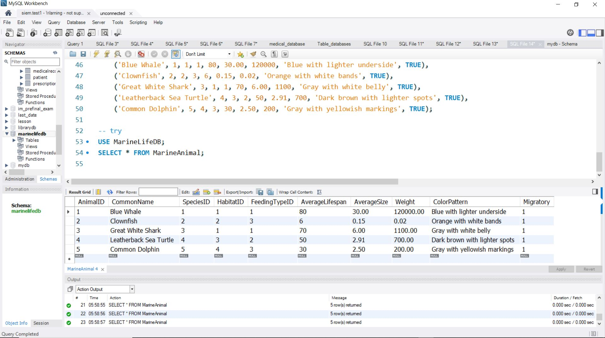

# sql-sample
A collectton of Marine animals SQL files.
# Marine Animal Database

This repository contains a **Marine Animal Database** designed to store data on marine species, habitats, feeding types, and conservation statuses. It is intended for research, conservation, and education.

## Features

- **Species**: Includes common names, scientific names, and conservation status.
- **Animal Characteristics**: Stores data on size, weight, lifespan, and feeding behavior.
- **Habitats**: Information on marine habitats like ocean, coral reefs, and deep-sea.
- **Feeding Types**: Differentiates animals by their feeding habits (e.g., Carnivore, Herbivore).
- **Conservation Status**: Tracks species' conservation status (e.g., Endangered, Vulnerable).

## Database Schema

- **Species**: Stores species name, scientific name, family, and conservation status.
- **Habitat**: Details about marine habitats.
- **MarineAnimal**: Tracks individual animal information linked to species, habitat, and feeding type.
- **FeedingType**: Stores feeding behavior types.
- **ConservationStatus**: Tracks species conservation status.

## Installation

1. Clone the repository:
   ```bash
   git clone https://github.com/YourUsername/MarineAnimalDatabase.git



